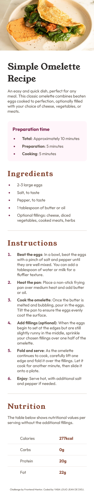
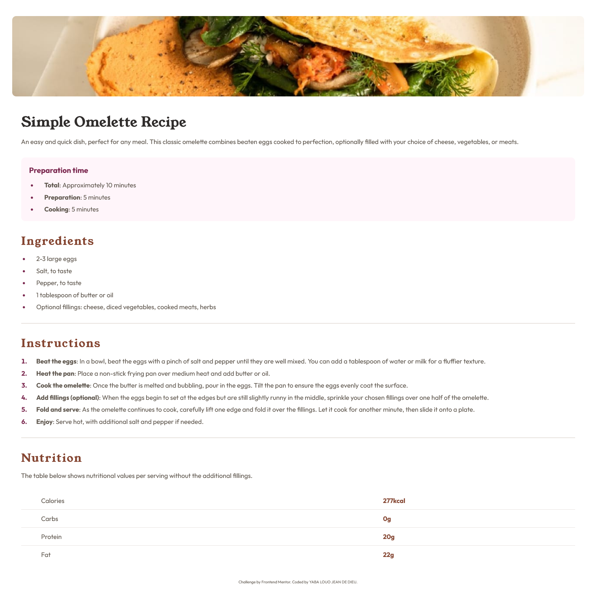

# Frontend Mentor - Recipe page solution

This is a solution to the [Recipe page challenge on Frontend Mentor](https://www.frontendmentor.io/challenges/recipe-page-KiTsR8QQKm). Frontend Mentor challenges help you improve your coding skills by building realistic projects. 

## Table of contents

- [Overview](#overview)
  - [The challenge](#the-challenge)
  - [Screenshot](#screenshot)
  - [Links](#links)
- [My process](#my-process)
  - [Built with](#built-with)
  - [What I learned](#what-i-learned)
- [Author](#author)

## Overview

### Screenshot




### Links

- Solution URL: [Add solution URL here](https://your-solution-url.com)
- Live Site URL: [Add live site URL here](https://your-live-site-url.com)

## My process

### Built with

- Semantic HTML5 markup
- CSS custom properties
- Flexbox
- Mobile-first workflow

### What I learned

I learned how to change the style of lists.

To see how you can add code snippets, see below:

```html
<ul>
  <li><strong>Total</strong>: Approximately 10 minutes</li>
  <li><strong>Preparation</strong>: 5 minutes</li>
  <li><strong>Cooking</strong>: 5 minutes</li>
</ul>
```
```css
li::marker, strong {
    font-weight: bold;
    color: var(--rose-800);
    vertical-align: center;
}
```

## Author

- Website - [https://github.com/victoire20](https://github.com/victoire20)
- Frontend Mentor - [@victoire20](https://www.frontendmentor.io/profile/victoire20)
